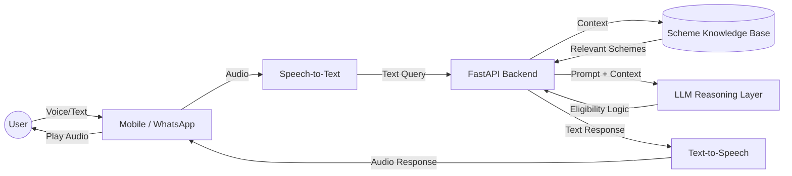

# JanSahayak AI 🇮🇳

> **Bridging the gap between citizens and government welfare schemes through multilingual voice AI.**


---

## 🧐 Problem Statement

Despite the existence of thousands of government welfare schemes in India, a significant portion of the intended beneficiaries fails to access them. The primary barriers are:

*   **Language Barriers:** Most information is in English or formal Hindi, alienating rural populations.
*   **Complex Portals:** Navigation requires high digital literacy.
*   **Eligibility Confusion:** Citizens often don't know which schemes apply to them.
*   **Lack of Awareness:** Information is fragmented across various departments.

## 💡 Solution

**JanSahayak AI** is an intelligent, voice-first assistant designed for the "Next Billion Users." It allows citizens to:
1.  **Speak** in their native language to ask about schemes.
2.  **Verify** their eligibility through natural conversation.
3.  **Understand** application procedures without navigating complex websites.

It combines the power of **Large Language Models (LLMs)** with **Speech-to-Text (STT)** and **Text-to-Speech (TTS)** engines to act as a personal welfare consultant.

---

## ✨ Key Features

| Feature | Description | Benefit |
| :--- | :--- | :--- |
| **Multilingual Voice Support** | Interact using voice in Hindi, Tamil, Telugu, etc. | Removes literacy and language barriers. |
| **Eligibility Engine** | Analyzes age, income, and occupation to filter schemes. | Personalized recommendations, saving time. |
| **WhatsApp Integration** | Accessible directly via WhatsApp chat. | No need to download a new, unfamiliar app. |
| **Document Guidance** | Lists exact documents needed for applications. | Reduces rejection capability due to missing files. |
| **Simplified Summaries** | Converts complex government jargon into simple text. | Makes legal terms easy to understand. |

---

## ⚙️ How It Works

1.  **User Initiates:** User opens the app or WhatsApp and asks, *"Mere liye koi kisan loan hai kya?"* (Is there any farmer loan for me?)
2.  **Processing:** The audio is transcribed to text (STT) and translated to English/Hindi for the system.
3.  **Eligibility Check:** The AI asks follow-up questions if needed (e.g., *"How much land do you own?"*).
4.  **Retrieval:** The system queries the vector database for relevant schemes matching the profile.
5.  **Response:** The AI generates a helpful response, summarizes the scheme, and explains how to apply.
6.  **Output:** The text is converted back to speech (TTS) and played to the user.

---

## 🏗️ System Architecture



---

## 🛠️ Tech Stack

| Component | Technology |
| :--- | :--- |
| **Frontend** | React Native / WhatsApp Business API |
| **Backend** | Python, FastAPI |
| **AI Models** | OpenAI GPT-4o / AWS Bedrock |
| **Speech Services** | OpenAI Whisper (STT) / ElevenLabs (TTS) |
| **Database** | PostgreSQL (User Data), Pinecone (Vector DB) |
| **Cloud** | AWS / Render |

---

## 📱 User Interface (Mockups)

### 1. Home Screen
```text
+-----------------------------+
|      JanSahayak AI      (=) |
+-----------------------------+
|                             |
|      👋 Namaste, Ritesh!    |
|                             |
|    [  Tap to Speak  ]       |
|          🎙️                |
|                             |
|  "Mujhe PM Awas Yojana      |
|   ke baare mein batao"      |
|                             |
+-----------------------------+
```

### 2. Eligibility Result
```text
+-----------------------------+
|      Scheme Details     (<) |
+-----------------------------+
|                             |
| 🏛️ PM Kisan Samman Nidhi    |
|                             |
| ✅ You are ELIGIBLE         |
|                             |
| Benefit: ₹6,000 / year      |
|                             |
| Documents Needed:           |
| 1. Aadhaar Card             |
| 2. Land Ownership Papers    |
|                             |
| [ Apply Now ]  [ Share ]    |
+-----------------------------+
```

---

## 🚀 Installation & Setup

To run the backend server locally:

1.  **Clone the repository**
    ```bash
    git clone https://github.com/ritesh-1918/jansahayak-ai.git
    cd jansahayak-ai
    ```

2.  **Create a virtual environment**
    ```bash
    python -m venv venv
    source venv/bin/activate  # On Windows: venv\Scripts\activate
    ```

3.  **Install dependencies**
    ```bash
    pip install -r requirements.txt
    ```

4.  **Set up environment variables**
    Create a `.env` file:
    ```env
    OPENAI_API_KEY=your_api_key
    PINECONE_API_KEY=your_key
    DATABASE_URL=postgres://...
    ```

5.  **Run the server**
    ```bash
    uvicorn main:app --reload
    ```
    The API will be available at `http://localhost:8000`.

---

## 🔮 Future Scope

*   **Healthcare Integration:** Direct booking of appointments at government hospitals.
*   **Job Assistance:** Matching rural youth with MNREGA and skill development programs.
*   **Education Support:** Scholarship discovery for students based on marks and category.
*   **Offline Mode:** sms-based query system for areas with no internet.

---

## 🌏 Impact

JanSahayak AI aims to empower the **65% of India's population** residing in rural areas. By democratizing access to information, we hope to:
*   Increase the utilization rate of government funds.
*   Reduce dependency on middlemen and agents.
*   Empower citizens to claim their rights with dignity.

---

## 👥 Contributors

*   **Team JanSahayak** - Hackathon Participation

---

## 📄 License

This project is licensed under the MIT License - see the [LICENSE](LICENSE) file for details.
